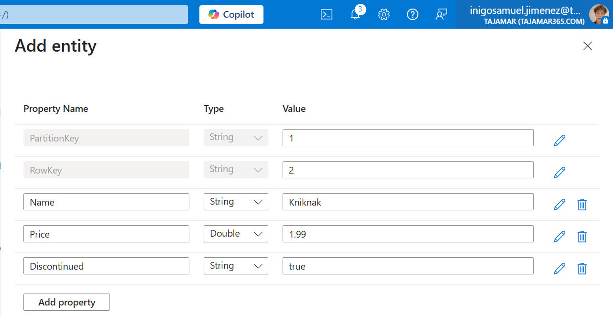

# Laboratorio 2: Exploración de Azure Storage
Basado en el laboratorio oficial del curso **DP-900: Azure Data Fundamentals**
Fuente original: [Explore Azure Storage (Microsoft Learn)](https://microsoftlearning.github.io/DP-900T00A-Azure-Data-Fundamentals/Instructions/Labs/dp900-02-storage-lab.html)

Este laboratorio te guía paso a paso para crear y explorar una cuenta de almacenamiento en Azure, utilizando los principales servicios:
- Blob Storage
- Data Lake Storage Gen2
- Azure Files
- Azure Tables

Duración estimada: ~15 minutos

---

## Índice

1. [Requisitos previos](#1-requisitos-previos)
2. [Provisionar una cuenta de almacenamiento](#2-provisionar-una-cuenta-de-almacenamiento)
3. [Explorar Blob Storage](#3-explorar-blob-storage)
4. [Habilitar Azure Data Lake Storage Gen2](#4-habilitar-azure-data-lake-storage-gen2)
5. [Explorar Azure Files](#5-explorar-azure-files)
6. [Explorar Azure Tables](#6-explorar-azure-tables)
7. [Limpieza de recursos](#7-limpieza-de-recursos)
8. [Resumen de conceptos sobre almacenamiento en Azure](#8-resumen-de-conceptos-sobre-almacenamiento-en-azure)

---

## 1. Requisitos previos

- Una suscripción de **Microsoft Azure** con permisos administrativos.
- Acceso al **Azure Portal**: [https://portal.azure.com](https://portal.azure.com).
- Archivos de ejemplo descargados: [product1.json](https://aka.ms/product1.json) y [product2.json](https://aka.ms/product2.json).

---

## 2. Provisionar una cuenta de almacenamiento

1. Inicia sesión en el portal y selecciona **+ Create a resource** → busca **Storage account** → **Create**.
2. Configura los parámetros básicos:
   - **Subscription:** tu suscripción.
   - **Resource group:** crea uno nuevo si es necesario.
   - **Storage account name:** nombre único (minúsculas y números).
   - **Region:** una región cercana.
   - **Performance:** *Standard*.
   - **Redundancy:** *Locally-redundant storage (LRS)*.
3. En **Advanced**, deja desactivada la opción *Hierarchical Namespace* (la activarás más adelante).
4. En **Data Protection**, desactiva las opciones de *soft delete*.
5. Revisa y crea la cuenta.

---

## 3. Explorar Blob Storage

1. En la cuenta creada, ve a **Data storage → Containers**.
2. Haz clic en **+ Container**, nómbralo `data`, y elige *Private (no anonymous access)*.
3. Abre **Storage browser → Blob containers** y verifica que aparece `data`.
4. Entra en el contenedor y crea una carpeta virtual llamada `products`. Fíjate que al no subir un blob a esta carpeta, no se crea.
5. Sube el archivo `product1.json` dentro de la carpeta virtual `product_data`.
6. Observa que las carpetas son virtuales: no hay acciones como renombrar o eliminar a nivel de carpeta.

---

## 4. Habilitar Azure Data Lake Storage Gen2

> [!WARNING]
> Debido a que la mejora a *Azure Data Lake Storage Gen2* está temporalmente deshabilitada este apartado no se puede realizar.

1. En el menú de la cuenta, selecciona **Settings → Data Lake Gen2 upgrade**.
2. Activa **Hierarchical Namespace** para convertir la cuenta a formato Gen2.
3. Espera a que finalice la actualización.
4. Regresa a **Storage browser → Blob containers → data → product_data**.
5. Sube `product2.json` al mismo contenedor.
6. Verifica que ahora la carpeta `product_data` muestra opciones de gestión (renombrar, permisos, etc.).

---

## 5. Explorar Azure Files

1. En la cuenta, selecciona **File shares** bajo *Data storage*.
2. Crea un nuevo recurso compartido con:
   - **Name:** `files`
   - **Tier:** *Transaction optimized*
3. En *Backup* desactiva `Enable backup`.
4. Abre el recurso compartido y haz clic en **Connect** para ver los scripts de conexión (Windows, Linux, macOS).
5. Cierra y regresa a la lista de *File shares*.

---

## 6. Explorar Azure Tables

1. En el panel de la cuenta, selecciona **Data storage** → **Tables** → **+ Table** → nómbrala `products`.
2. Abre **Storage browser → Tables → products**.
3. Haz clic en **+ Add entity** e ingresa:
   - PartitionKey = 1
   - RowKey = 1
   - Name = Widget
   - Price = 2.99
4. Inserta la entidad.
5. Agrega una segunda entidad con:
   - PartitionKey = 1
   - RowKey = 2
   - Name = Kniknak
   - Price = 1.99
   - Discontinued = true
6. Inserta la entidad y comprueba que las dos tienen una columna **Timestamp**.

---

## 7. Limpieza de recursos

Para evitar cargos innecesarios:

1. Entra al **Resource group** que contiene la cuenta de almacenamiento.
2. Haz clic en **Delete resource group**.
3. Confirma el nombre del grupo y acepta.

---

# 8. Resumen de conceptos sobre almacenamiento en Azure

---

## 1. ¿Cuál es la diferencia fundamental entre Azure Data Lake Storage Gen1 y Gen2?

- **Gen1**: servicio independiente diseñado para análisis masivo con un sistema de archivos jerárquico.
- **Gen2**: versión integrada en **Azure Storage**, que combina:
  - Escalabilidad y control de costes de *Blob Storage*.
  - Capacidades jerárquicas del Data Lake.

En resumen: **Gen2 unifica Blob Storage y Data Lake**, ofreciendo mayor rendimiento, integración nativa y reducción de costes.

---

## 2. ¿Qué se debe hacer en una cuenta de Azure Storage para habilitar las capacidades de Azure Data Lake Storage Gen2?

Para activar las funciones de Data Lake Gen2 en una cuenta de Azure Storage se debe **habilitar la opción “Hierarchical Namespace”** (espacio de nombres jerárquico).

- Puede hacerse al crear o actualizar la cuenta.
- Es un cambio **irreversible**: una vez habilitado, no se puede volver a un espacio de nombres plano.

---

## 3. ¿Qué es Microsoft OneLake y cuál es su relación con Microsoft Fabric?

- **Microsoft OneLake** es un *data lake lógico, único y unificado* para toda la organización, construido sobre **Azure Data Lake Storage Gen2**.
- Cada inquilino de **Microsoft Fabric** incluye automáticamente un OneLake.

**Ventajas principales:**
- Colaboración centralizada mediante espacios de trabajo (workspaces).
- Uso compartido de datos sin necesidad de duplicarlos.
- Compatibilidad con **formatos abiertos** (como Delta Parquet) y con las APIs de ADLS Gen2.

---

## 4. Describa los dos niveles de rendimiento que ofrece Azure Files

| Nivel | Tipo de hardware | Características | Uso recomendado |
|--------|------------------|-----------------|----------------|
| **Standard** | HDD | Menor coste, rendimiento básico. | Archivos de uso general o copias de seguridad. |
| **Premium** | SSD | Mayor rendimiento y baja latencia. | Aplicaciones críticas o de alto rendimiento. |

---

## 5. ¿Cuáles son los tres tipos de blobs que admite Azure Blob Storage?

| Tipo de Blob | Descripción | Uso principal | Tamaño máximo |
|---------------|--------------|----------------|----------------|
| **Block Blob** | Conjunto de bloques independientes. | Archivos grandes (imágenes, vídeos, copias de seguridad). | Hasta 190 TiB |
| **Page Blob** | Páginas de 512 bytes con acceso aleatorio. | Discos virtuales de máquinas virtuales. | Hasta 8 TB |
| **Append Blob** | Variante optimizada para añadir datos al final. | Registros de logs o auditorías. | Hasta ~195 GB |

---

## 6. Explique el propósito de los contenedores y las carpetas virtuales en Azure Blob Storage

- **Contenedores:** agrupan blobs relacionados y definen permisos de acceso a nivel de grupo.
- **Carpetas virtuales:** son una estructura lógica creada mediante el carácter “/” en los nombres de los blobs.
  - No existen físicamente ni tienen permisos propios.
  - Sirven solo para organizar visualmente los archivos dentro del contenedor.

---

## 7. ¿En qué se diferencia una tabla de Azure Table Storage de una tabla de una base de datos relacional?

| Característica | **Azure Table Storage (NoSQL)** | **Base de Datos Relacional (SQL)** |
|----------------|----------------------------------|------------------------------------|
| Estructura | Flexible; las columnas pueden variar por fila. | Estructura fija; todas las filas comparten las mismas columnas. |
| Relaciones | No admite claves foráneas ni joins. | Usa claves foráneas y relaciones entre tablas. |
| Normalización | Desnormalizada; una fila contiene toda la información de una entidad. | Normalizada; los datos se dividen entre varias tablas. |
| Enfoque | Escalabilidad, rendimiento y almacenamiento masivo. | Integridad referencial y consistencia estructurada. |

---

## 8. ¿Qué dos elementos componen la clave única de una fila en Azure Table Storage y cuál es su función?

Cada fila se identifica mediante una clave compuesta por dos elementos:

| Elemento | Función | Beneficio |
|-----------|----------|------------|
| **Partition Key** | Identifica la partición que agrupa filas relacionadas. | Mejora la escalabilidad y localización eficiente. |
| **Row Key** | Identificador único dentro de la partición. | Permite consultas rápidas por punto o rango. |

Ambas claves forman una **clave única global** que optimiza las búsquedas y la distribución de datos.

---

## 9. ¿Cuál es el propósito principal de Azure Files y qué problema resuelve en comparación con los recursos compartidos de archivos locales?

**Azure Files** permite crear recursos compartidos de archivos en la nube accesibles mediante SMB o REST.

**Problema que resuelve:**
Los recursos de archivos locales (LAN) no escalan bien y son difíciles de acceder desde distintas ubicaciones.

**Ventajas:**
- Sin necesidad de hardware ni mantenimiento físico.
- Alta disponibilidad y escalabilidad.
- Acceso unificado desde entornos locales o en la nube.

---

## 10. Describa brevemente los tres niveles de acceso disponibles para Azure Blob Storage

| Nivel | Uso principal | Costo | Latencia / Disponibilidad |
|--------|----------------|--------|----------------------------|
| **Hot (Caliente)** | Datos accedidos con frecuencia. | Más alto. | Baja latencia (milisegundos). |
| **Cool (Frío)** | Datos accedidos ocasionalmente. | Más bajo. | Milisegundos; menor disponibilidad. |
| **Archive (Archivo)** | Datos históricos o raramente usados. | Muy bajo. | Alta latencia (horas; requiere rehidratación). |

**Gestión del ciclo de vida:**
Azure permite políticas automáticas que mueven los blobs entre niveles (Hot → Cool → Archive) o eliminan datos antiguos según su uso y antigüedad.

---

## Conclusión

El ecosistema de almacenamiento de Azure ofrece soluciones adaptadas a distintos escenarios:

- **Data Lake Gen2 y OneLake:** analítica avanzada y colaboración a gran escala.
- **Blob Storage:** almacenamiento masivo y flexible con control de costes.
- **Azure Files:** alternativa en la nube a los servidores de archivos locales.
- **Table Storage:** almacenamiento NoSQL escalable para grandes volúmenes de datos.

Cada servicio se integra dentro de Azure Storage, ofreciendo **rendimiento, seguridad y flexibilidad** tanto para cargas operativas como analíticas.
